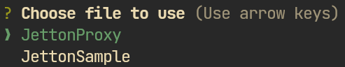

# blueprint-misti

A plugin for the [Blueprint Framework](https://github.com/ton-org/blueprint/) that simplifies your workflow with the [Misti](https://nowarp.github.io/tools/misti/) static analyzer.

## Getting Started

1. [Install Soufflé](https://souffle-lang.github.io/install) to use all detectors provided by Misti.

2. Add this plugin as a dependency of your Blueprint project:
```bash
yarn add @tact-lang/compiler
yarn add @nowarp/blueprint-misti
```

3. Add this configuration to `blueprint.config.ts`:
```ts
import { MistiPlugin } from '@nowarp/blueprint-misti';
export const config = {
  plugins: [
    new MistiPlugin(),
  ],
};
```

## Usage

Run the following command:
```bash
yarn blueprint misti
```

It will run the analysis of the available project, if there is one, or show an interactive window to select a project:



See the [documentation](https://nowarp.io/tools/misti/) for the available configuration options.

## Resources
* [Misti: GitHub](https://github.com/nowarp/misti)
* [Misti Documentation: Using with Blueprint](https://nowarp.io/tools/misti/docs/tutorial/blueprint)
